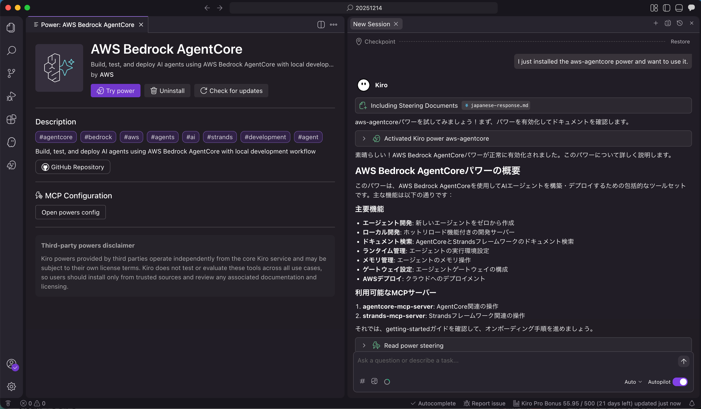

# Amazon Bedrock AgentCore 用 Kiro power の 日本語訳

これは [AgentCore 用 Kiro power](https://github.com/kirodotdev/powers/tree/main/aws-agentcore) の日本語訳です。
この Kiro power は Amazon Bedrock AgentCore を用いて AI エージェントをローカルで開発し、テスト・デプロイすることを支援します。

## ライセンス

オリジナルリポジトリ (https://github.com/kirodotdev/powers) で現状ライセンスが明示されていません。
あくまでオリジナル版が著作権を所有しており、本翻訳は参考用としてください。

## そもそも Kiro powers とは

Kiro powers は Kiro に特定の専門知識や技能を瞬時に与える拡張機能です。
MCPツール、ステアリングファイル、フックを一つのパッケージにまとめたもので Kiro にワンクリックでインストールできます。
そして、必要な機能（power）だけが会話の文脈に応じて動的に読み込まれます。
例えば、ユーザーが「ドキュメントを検索して」と指示すると、Knowledge Base Powerが有効化されます。
これにより Kiro は 不要な情報による混乱（コンテキストの過負荷）を防ぎ、高速かつ高品質な応答を維持します。
今後様々な、各分野に特化した power が開発・提供されていくことにより Kiro は各分野の専門家になることを期待できます。

## 内容物

- `POWER.md`: power の定義と利用可能な MCP ツールの概要
- `mcp.json`: 必要に応じて利用する MCP Server の定義
- `steering/getting-started.md`: 前提条件、`agentcore create` の使い方、ローカル開発・呼び出し・デプロイの流れ
- `steering/agentcore-memory-integration.md`: Strands エージェントへのメモリ統合方法、CLI コマンド、ベストプラクティス
- `steering/agentcore-gateway-integration.md`: Gateway（MCP エンドポイント）で Lambda / OpenAPI / Smithy / MCP サーバーをツール化する手順

## クイックスタート

<!-- markdownlint-disable MD033 -->

<!-- markdownlint-enable MD033 -->
